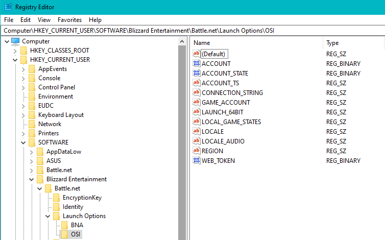

### Battle Net Tokens
Registry Keys are used to authenticate with Battle.net Servers. Here are the Keys being watched for changes by this application.

On changes, the background service is notified and saves the auth token to disk inside `./settings.json`

The inject method will stuff a specific accounts token into the registry. This allows us to not have to login to bnet for each run of the application.

### Where are Tokens Stored
Tokens are stored in the game folder for each account as `multi-launcher-auth.bin` as a base64 encoded json string.

Note: These are not enough to impersonate.

A short hash is created from that auth token so we can determine if we got a new token from a registry changed event.