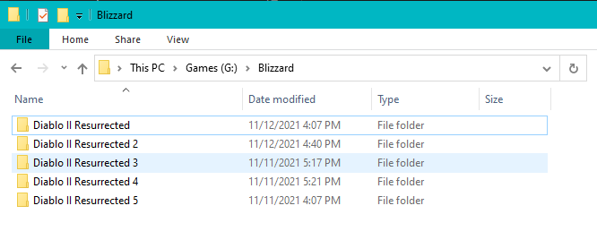
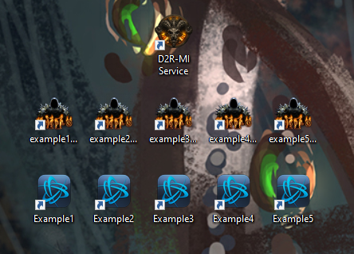

### Required Setup of D2R Game Files
In order to run multiple copies of D2R with this application you will need a folder for each account with the game files. 

Example:

This obviously can lead to alot of required disk space for fleet setups. You can sym link most game files but in my experience that has lead to instability.

If you have a better way to solve this issue or know what files are stable to sym link, please create an issue and I can add a script for that!

### Desktop Shortcuts
Desktop shortcuts are generated as part of the setup process. By Default they are created on your desktop. 

2 for each Account. 
    - Shortcut for Launching the Game (D2 Logo)
    - Shortcut for Logging into Battlenet with that Account (Bnet Logo)

1 For the Background Service that should be launched before running the game in order to capture all refresh tokens.

