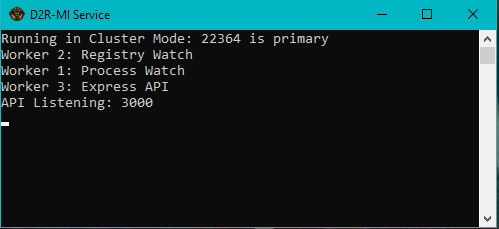

### Running as a Service
This CLI supports being run a service while listening to windows registry and window events for d2. This can add some background system overhead. However this is the most convient way to run the application until electron interface is added.




### Setup 
In order to run the Instance Manager as a background service, you will need to first run the setup initializer.

Navigate to Project Directory in Terminal and Run

```
npm run setup
```

This will allow you to enter your account information and general preferences.


### Running
After Setup you should have an Icon on your desktop called `D2R-MI Service`. Use this to run the background service or if you prefer to use command line.

```
npm run service
```

- Service will now be started with 4 Worker Nodes

### Background Service Overview
Since listening for Registry and Process changes for D2 is blocking, 2 worker nodes are spun up alongside the main process using Node's internal [Cluster](https://nodejs.org/api/cluster.html) API.

### Worker 1: Process Watcher
This worker will scan for active d2r processes that include the handler method to prevent multiple instances. If it finds it, it will kill the handler and change the application window to match the display name in `./settings.json`.

### Worker 2: Registry Watcher
This worker will watch the D2R OSI key in the windows registry for changes and report those events to the main process. When a registry item is changed, we know a token was refreshed and save that to disk.

The `ACCOUNT` sub key in OSI only changes during the login process from the Battle.net client. The backend process utilizes this to keep a relationship between a token and its account.

Refresh events will also include this `ACCOUNT` key value, so if we capture all of them.. we can stay authenticated.

### Worker 3: API 
Basic endpoints are available. Default Port is 3000 but that can be changed in setup config.

| Endpoints | Description |
| --- | ----------- |
| `/accounts` | List Stored Accounts |
| `/process` | List Current Running Processes |
| `/settings` | Output Current Settings  |

ie. `http://127.0.0.1:3000/accounts`

Currently doesnt support modifications, its just for debugging.

### Worker 4: Token Rotator
This worker is responsible for rotating the current token in registry to the oldest one that we have stored. It helps keep us authenticated across all accounts for as long as possible.


### Platform Support
Currently this only works on Windows. PR's are welcome by any Mac gamers :). The current functionality uses win32api for system events.

