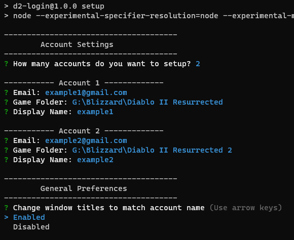

### How to Setup / Configure this Tool
Please see [Game Files](./game-files) to ensure you have the proper directory structure before running the setup command.

### Setup of This Utility
1) Install Node.js 
2) Download Project (Git or https)
3) Navigate to Project Directory and run `npm install` via cmd or run `setup.bat`

### CLI Setup
CLI Config options are setup by running `npm run setup`. 

This will allow you to save accounts based on folder directories so the handler manager can notify you of what accounts are signedIn and rename the application windows for better tracking.

Unique folders are required by bnet and this application because we can associate running processes based on their source directory.

### Settings.Json
CLI Setup script will write to a `settings.json` file in the root of the application. You can modify settings manually in this file or re-run setup if the account information changes.
