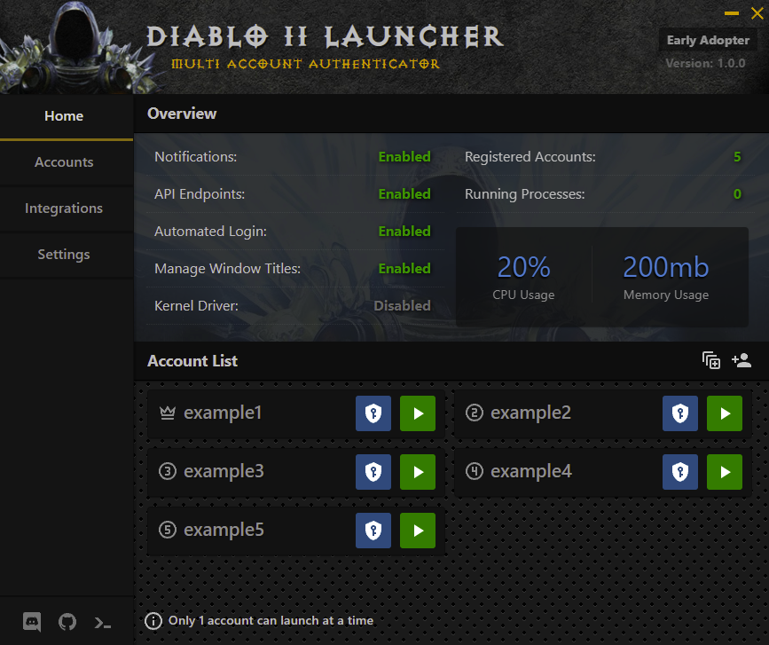

##  D2R Multi Authenticator (D2RMA)
Diablo 2 Resurrected Multi Account Authenticator & Toolkit.

 
<strong>Table of Contents</strong> (click to expand)

- [D2RMA](#d2r-multi-authenticator-(d2rma))
  - [🎮 What is D2RMA](#-what-is-d2rma)
  - [🚀 Getting Started](#-getting-started)
  - [🎮 Download](#-download)
  - [🎨 Features](#-features)
  - [💾 Compilation](#-how-to-build)
    - [⚙️ Requirements](#️-requirements)
    - [▶️ Steps](#️-steps)
  - [🚀 Technologies](#-technologies)
  - [🎁 Contributing](#-contributing)
  

_

## 🎮 What is D2RMA
D2RMA is a custom launcher for Diablo 2 Resurrected that aims to ease the pain of running multiple accounts.

This is a mono repo containing multiple apps/packages and build processes. 

## 🖥️ Apps
| Type      | Description |
| ----------- | ----------- |
| [Electron](./apps/electron)      | Electron Client App for D2RMA |
| [Web](./apps/web)   | Hosted Website for D2RMA |
| [Wiki](./apps/web)   | Hosted Documentation Wiki |

## 📦 Packages
| Type      | Description |
| ----------- | ----------- |
| [Automation](./packages/automation)      | OCR Library for Unassisted Login / Lobby Management |
| [Battle.net](./packages/battle.net)      | Methods for interacting with Installed Battle.net Agent |
| [GraphQL](./packages/graphql)   | GraphQL APIs for Electron/Web |
| [Level-DB](./packages/level-db)   | Embeded Database Storage Library for Client Machine |
| [UI](./packages/ui)   | React UI Component Library (Storybook) |
| [Utils](./packages/utils)   | General Use Utility Functions for OS |

## ✔️ Features
- Run Multiple D2R instances on 1 or a Fleet of PCs
- UI Automation for Unassisted Login
- Pre Authenticated Login Support
- Background Process for handling periodic refresh tokens
- GraphQL API Endpoints to support external 3rd party integrations
- Squad support for launching multiple accounts at once
- Full Customization of D2R Client Settings
- Internal Plugin System for 3rd Party Tools 

## Features being worked on
- Kernel Driver for Reading D2R Game Data
- D2R Game Data pulled from Installed MPQ's
- Rich Plugin Ecosystem (Remote Install)

## 🚀 Getting Started

Below you will find everything you need to know about the launcher. If you want to download the latest stable release you can do it from our official website ([d2rma.io](https://d2rma.io)). If you want to test the possibly unstable features, you can clone the repo and build it yourself.

## ⚙️ Build Requirements

You need the following software installed by default for all packages.

- [NodeJS](https://nodejs.org/en/download/) (> v14.14.0 x64)
- [Yarn3](https://yarnpkg.com/)

For Packages with Native Modules, you will need the following software installed

This project uses Yarn workspaces to enable the mono repo workflow. There may be additional dependencies required per package so make sure to check their individual readme's for more information.

## ▶️ Steps

You will need to switch to Yarn Berry 

`yarn set version berry`

Each Package is setup as an individual workspace, running `yarn install` inside the root project will install each packages dependencies.

To target a specific package, either cd into its directory and run `yarn install` or from the root folder `yarn workspace @d2r/package-name install`

## 🚀 Technologies
- [Typescript](https://babeljs.io/)
- [React](https://reactjs.org/)
- [Xstate](https://babeljs.io/)
- [NodeJS](https://nodejs.org/en/)
- [GraphQL](https://webpack.js.org/)
- [Electron](https://electronjs.org/)
- [Webpack](https://webpack.js.org/)
- [Storybook](https://webpack.js.org/)
- [ESLint](https://eslint.org/)
- [Styled Components](https://styled-components.com/)

See individual packages for list of Tech used in each. 

## 🎁 Contributing

You can find a list of unassigned tasks [here](https://github.com/justiceandy/d2-multi-instance). Feel free to ask anything on our discord if you need help or want other tasks.

1. Fork it!
2. Create your feature branch: `git checkout -b my-new-feature`
3. Commit your changes: `git commit -am 'Add some feature'`
4. Push to the branch: `git push origin my-new-feature`
5. Submit a pull request :D

## Module Duplication
You may notice that some node_modules are duplicated with this mono repo. 

Until build issues with Electron are resolved, we need to make sure packages arent hoisted so native-modules can be compiled against specific versions of node during the electron build process.

Eventually this should be solved with a rework of the Electron Builder. Currently we are using the default included with [Electron-React-Boilerplate](https://electron-react-boilerplate.js.org/)

## Disclaimers

Note: Core D2RMA functionality aligns with Blizzards Terms of Service. While Multiboxing is still a grey area, no injection or modification of Online game play is supported.

However, we understand that the offline battle.net community is large so support for mods/plugins and tools that are not authorized for use on Battle.net servers is available through the included 3rd Party Plugin Marketplace.

Plugins that are not advised for online use will specifically include a notice.

All Diablo content is copyright by @blizzard entertainment.
